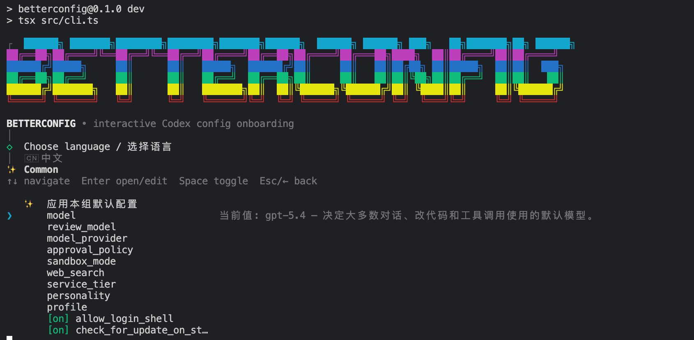

# betterconfig

> A keyboard-first setup wizard for Codex `config.toml`.
>
> 一个面向 Codex `config.toml` 的、键盘优先的交互式配置向导。

---

## 中文文档

### 目录

- [项目简介](#项目简介)
- [效果预览](#效果预览)
- [为什么是 betterconfig](#为什么是-betterconfig)
- [设计目标](#设计目标)
- [核心能力](#核心能力)
- [工作流概览](#工作流概览)
- [登录与接入设计](#登录与接入设计)
- [配置文件与快照设计](#配置文件与快照设计)
- [交互与 UI 设计](#交互与-ui-设计)
- [配置项说明设计](#配置项说明设计)
- [项目结构](#项目结构)
- [安装与运行](#安装与运行)
- [使用方式](#使用方式)
- [测试与验证](#测试与验证)
- [当前状态](#当前状态)
- [路线图](#路线图)

### 项目简介

`betterconfig` 是一个专门为 Codex CLI 准备的交互式配置工具。

它的目标并不是替代 `config.toml`，也不是重新发明一套配置体系，而是把
原本分散、抽象、容易出错的配置过程，整理成一个可以在终端里逐步完成的
setup wizard。对于第一次接触 Codex 的用户来说，这意味着他们不需要先读完
一整份配置文档，也不需要猜测某个字段到底应该写什么，才能得到一份能用、
稳妥、可回滚的配置文件。

从项目定位上讲，`betterconfig` 更像是 Codex 配置层的一块“用户体验补丁”。
Codex 本身已经具备丰富的配置能力，但丰富并不自动等于易用。模型、provider、
审批策略、沙箱、搜索、功能开关、代理、快照、路径、agent、profile——这些
能力放在 `TOML` 里当然合理，可一旦用户需要从零开始手动配置，门槛就会迅速
升高。`betterconfig` 的工作，就是把这些能力重新组织成清晰、可读、可理解的
终端流程。

因此，这个项目关注的从来不只是“写一个文件”。它更关心下面这些事情：

- 用户是否知道当前应该先做什么。
- 用户是否能在不查资料的情况下理解一个选项。
- 用户修改配置之后，是否还敢放心地继续使用。
- 如果写坏了，是否可以立刻回到之前的状态。
- 当用户使用官方登录与第三方 OpenAI-compatible 平台时，流程是否足够顺手。

换句话说，`betterconfig` 不是配置生成器的包装壳，而是一套面向真实用户的
配置体验设计。

### 效果预览

下面这张图展示了 `betterconfig` 的整体风格与交互轮廓：

- 有明确的彩色 Banner。
- 有清晰的一级/二级结构。
- 以键盘操作为中心。
- 在足够宽的终端里，说明会放到右侧；终端较窄时则降级到底部说明区。



### 为什么是 betterconfig

Codex CLI 的配置能力并不弱，甚至可以说相当完整。问题在于：完整的能力，
往往意味着更复杂的第一次使用体验。

很多用户在实际使用时会遇到几类很典型的问题：

1. **不知道有哪些配置项值得改。**
   模型、审批策略、沙箱、联网搜索、profile、feature flags、provider……
   这些词对熟悉 Codex 的用户很自然，但对新用户来说并不直观。

2. **知道有这个配置，但不知道它的真实含义。**
   一个字段名本身并不能说明足够多的信息。用户真正需要知道的是：
   这个选项会影响什么、它会带来什么取舍、什么时候值得改。

3. **可以手改 `config.toml`，但不敢动。**
   因为一旦写错，可能不是“这个选项没生效”这么简单，而是整个运行方式都被
   改坏。尤其当配置里已经包含第三方 provider、代理、实验性功能、profile
   覆盖项时，风险会更高。

4. **用户的实际环境并不整齐。**
   有的人用官方登录，有的人接第三方 OpenAI-compatible 平台；有的人会把
   URL 填成根域名，有的人会填到 `/v1/models`，还有的人会多写一个 `/v1`。
   这些都不是“错误用户”，只是现实世界的输入本来就会有噪声。

5. **配置不是一次性的。**
   用户可能今天想切回原始配置，明天想再回到优化后的配置；可能今天在公司网关
   下工作，明天在自己的机器上直接连接官方接口。配置需要的不只是“生成”，
   还包括“切换”和“恢复”。

`betterconfig` 就是在这样的背景下被设计出来的。

它希望解决的不是一个技术难题，而是一种长期被忽略的使用成本：
**配置能力越强，越需要一个能解释、能组织、能回滚的入口。**

### 设计目标

`betterconfig` 的设计目标很明确，而且彼此之间有优先级：

- **简单优先**
  默认思路永远是减少层级、减少动作、减少猜测，而不是追求“功能感”。

- **高效优先**
  用户不应该为了改一个布尔值走三层页面，也不应该为了一个枚举值看三次确认。

- **不替代 Codex，只补齐配置体验**
  官方登录依然交给 `codex login`；`betterconfig` 负责组织流程，而不是复制
  一套新的认证系统。

- **完整重构，但必须可回滚**
  项目采用完整生成 `config.toml` 的方式，而不是零碎 patch；与此同时，必须
  保存原始快照、最近一次生成快照与历史快照，确保用户随时可以切回去。

- **解释必须具体、短、可切换语言**
  每一个可编辑项，都应该有一句足够短但足够清楚的说明，并支持中文与英文。

- **键盘优先**
  `Enter`、`Space`、`Esc` 是第一公民。用户不应该被迫依赖鼠标，也不应该在终端
  里体验到像表单网站一样笨重的交互。

- **跨平台一致**
  `Windows`、`macOS`、`Linux` 的表现应尽量一致；真正无法一致的部分，也要在
  生成层做平台适配，而不是把差异甩给用户。

- **现实世界输入容错**
  第三方 provider 的 URL 不会总是规整。工具需要主动吸收常见的用户输入噪声。

### 核心能力

当前版本的 `betterconfig` 已经围绕上述目标实现了一套完整的基础能力：

- **彩色终端入口**
  提供带 Banner 的启动界面，让用户一进入就能感受到这是一个面向配置的 setup
  流程，而不是单纯的脚本问答。

- **语言选择**
  启动后首先选择 `中文` 或 `English`，之后菜单、说明、错误提示与引导信息都会
  使用对应语言。

- **Codex 安装检测**
  在真正进入配置流程前，先确认系统中是否已安装 `codex`。如果没有安装，工具
  会给出安装建议，但不会擅自修改用户环境。

- **官方登录检测与接力**
  如果用户选择官方登录，`betterconfig` 会把流程交给 `codex login`，并在完成后
  重新检查状态。

- **第三方 OpenAI-compatible 接入**
  支持填写第三方 URL 与 API Key，自动做候选 URL 修正、模型探测与连通性验证。

- **两层菜单结构**
  顶层是能力分组，进入后直接就是可改项；不再让用户在三级菜单里层层钻取。

- **键盘快速编辑**
  布尔值支持快速切换，枚举值直接打开短列表，文本项直接输入。

- **完整配置生成**
  工具根据 `template.toml`、用户选择与平台适配结果生成完整 `config.toml`。

- **原始配置快照与切换**
  首次进入会保存原始配置；后续支持切回原始版本、最近一次 `betterconfig`
  配置，以及历史快照。

- **双语选项说明**
  每个选项都尽量提供一条短解释，并优先参考官方 schema 与文档语义。

- **写入后健康检查**
  在写入后重新做解析与连接层面的基础检查，降低“写完就坏”的风险。

### 工作流概览

`betterconfig` 的核心工作流可以概括为下面这条路径：

```text
启动 Banner
  → 选择语言
  → 检查 codex 是否已安装
  → 检查认证状态
  → 官方登录或第三方接入
  → 进入两层配置菜单
  → 预览
  → 写入 config.toml
  → 健康检查
  → 需要时恢复快照
```

从交互上看，这条流程有两个关键特点：

- 前半段是“准备系统处于可配置状态”。
- 后半段是“在可回滚前提下修改配置”。

这种拆分并不是形式主义，而是有明确好处的：
如果一个用户连 `codex` 都没安装，或者登录根本还没准备好，那么让他直接去改
模型、provider、审批策略，其实只会制造更多困惑。先把环境状态拉平，再谈配置，
整个体验会更顺。

### 登录与接入设计

登录与接入是 `betterconfig` 最重要的“门槛前置”设计之一。

#### 官方登录

对于官方登录，项目始终坚持一个原则：
**不复制官方登录，只接力官方登录。**

这意味着：

- `betterconfig` 负责检测官方登录是否可用。
- 如果不可用，用户可以选择官方登录路径。
- 一旦进入这条路径，真正执行的是 `codex login`。
- 登录返回后，再由 `betterconfig` 继续后续流程。

这样做的好处非常明确：

- 避免维护一套平行认证逻辑。
- 避免和 Codex 自己的认证机制脱节。
- 能够自然兼容官方后续登录方式的演化。

#### 第三方 OpenAI-compatible 平台

第三方接入的设计目标不是“支持一切协议”，而是先把最常见、最现实的路径做稳。

因此当前版本聚焦在：

- OpenAI-compatible API
- URL 智能修正
- API Key 验证
- 模型列表探测
- 连接失败分类提示

典型问题包括：

- 用户填的是根域名，而不是 API base URL。
- 用户多写了 `/v1`。
- 用户直接填到了 `/models` 或 `/chat/completions`。
- 用户服务在本地，协议应为 `http` 而非 `https`。

`betterconfig` 并不会把这些输入简单判错，而是尽量基于常见规则生成候选地址，再逐个探测。

这部分设计反映的是一个很实际的判断：
**用户并不总是输入“标准答案”，所以工具本身必须足够有耐心。**

### 配置文件与快照设计

配置生成与快照管理，是 `betterconfig` 和普通“问答脚本”之间的真正分水岭。

#### 为什么采用完整重构

本项目生成 `config.toml` 时采用的是**完整重构**策略，而不是局部 patch。

原因很简单：

- 如果只改几个字段，旧配置里残留的未知内容可能继续影响行为。
- 对用户来说，最终文件是否清晰、有序、可读，同样很重要。
- 对自动化测试来说，稳定顺序的完整输出也更容易验证。

当然，完整重构也意味着更高的责任：
工具必须知道怎么回滚，必须知道怎么保留历史，必须确保用户不被一份新文件“困住”。

#### 快照策略

`betterconfig` 默认维护三类状态：

- **原始配置**：第一次进入时捕获
- **最近一次 betterconfig 生成配置**
- **历史快照**：每次覆盖前保存一份时间戳版本

这套设计的核心价值不在于“看起来高级”，而在于让用户敢用。

一个真正可用的配置工具，不只是帮用户生成配置，更要帮用户保住退路。

### 交互与 UI 设计

UI 不是本项目的主角，但它是决定易用性的关键细节。

当前的 UI 原则很简单：

- **Banner 要有辨识度**
  第一眼就告诉用户：这不是普通脚本，而是配置入口。

- **菜单层级要少**
  顶层分组，进入后直接可改。减少无意义层级，是效率的前提。

- **键盘操作优先**
  `Enter` 进入，`Space` 快速切换布尔值，`Esc` 返回。

- **说明不打扰列表阅读**
  终端足够宽时，说明放在右侧；终端较窄时再降级到底部。

这部分的重点并不是视觉堆砌，而是让界面每一次刷新都服务于一个目的：
**让用户更快看懂、更快定位、更快修改。**

### 配置项说明设计

`betterconfig` 对配置项说明的要求非常明确：

- 要短
- 要准
- 要能直接帮助用户决策
- 要支持中文与英文

这听起来像是小事，实际上非常重要。

很多 CLI 配置工具的问题并不是“没有功能”，而是“字段名本身不足以解释功能”。
用户真正需要的是一句能立即回答下面问题的话：

- 它影响什么？
- 我什么时候应该改它？
- 改完的方向是什么？

因此，项目在说明生成上优先参考：

1. 官方 schema
2. 官方文档
3. 官方仓库里的配置说明与样例
4. 在此基础上整理出的双语短说明

这让 `betterconfig` 的说明层尽量避免变成“作者自己的解释”，而更接近真实语义。

### 项目结构

下面是当前项目的主要目录：

```text
betterconfig/
├── src/
│   ├── app/               # 主流程编排
│   ├── codex/             # 本机 codex 检测与登录适配
│   ├── config/            # 模板解析、会话状态、配置生成
│   ├── explanations/      # 选项说明目录
│   ├── health/            # 写入后的健康检查
│   ├── providers/         # 第三方 provider 探测
│   ├── schema/            # 官方 schema 解析
│   ├── state/             # 快照与状态存储
│   └── ui/                # 终端渲染与交互驱动
├── tests/                 # 单元、交互、E2E 回归测试
├── data/                  # 官方 schema 与说明覆盖数据
├── docs/                  # 设计文档与配图
└── template.toml          # 当前推荐配置模板
```

如果只看模块边界，这个项目本质上分成四层：

- 外层 CLI 与交互
- 中层流程与状态
- 底层配置生成与 provider 探测
- 验证与测试

### 安装与运行

当前版本采用 Node.js + TypeScript 开发。

#### 环境要求

- Node.js `>= 20`
- 一个可用的 `npm`
- 本机可访问的 `codex` CLI（如果你要测试官方登录或真实运行）

#### 全局安装（推荐）

```bash
npm install -g betterconfig-cli
```

安装完成后，直接在终端运行：

```bash
betterconfig
```

#### 本地开发运行

```bash
npm install
npm run dev
```

#### 构建

```bash
npm run build
```

#### 运行构建产物

```bash
node dist/cli.js
```

### 使用方式

如果你第一次使用 `betterconfig`，推荐按下面的顺序进行：

1. 运行 `betterconfig`
2. 选择语言
3. 如果没有安装 `codex`，先根据提示安装
4. 如果没有登录：
   - 选官方登录，交给 `codex login`
   - 或选第三方 OpenAI-compatible 接入
5. 进入 `Common` 分组
6. 调整你最常用的配置
7. 到 `Review & Write` 预览并写入
8. 如果结果不满意，再去 `Snapshots` 切回原始配置或最近配置

这套流程的设计目标不是“尽可能灵活”，而是“尽可能少犯错”。

### 测试与验证

`betterconfig` 目前已经围绕核心路径建立了完整的自动化回归测试。

覆盖范围包括：

- 模板解析
- 配置生成
- 说明生成
- 第三方 provider URL 规范化
- 第三方连通性探测
- 快照与恢复
- 菜单交互
- 两层菜单回归
- `Esc` 返回行为
- 写入失败后的回滚
- 系统 `codex` 适配器

常用验证命令：

```bash
npm run lint
npm test
npm run build
```

这三步全部通过，才意味着代码和文档至少在当前仓库上下文里保持了一致性。

### 当前状态

截至目前，`betterconfig` 已经具备：

- 可运行的 Node.js CLI 骨架
- 彩色 Banner
- 中英双语基础交互
- 官方登录检测与接力
- 第三方 OpenAI-compatible 探测
- 两层配置菜单
- 完整 `config.toml` 生成
- 原始/最近/历史快照逻辑
- 自动化测试覆盖核心路径

但项目仍在持续打磨中。尤其是终端布局、窄屏表现、显示名、更多配置项体验优化，
都还存在继续提升空间。

### 路线图

接下来更值得继续打磨的方向包括：

- 更友好的字段显示名，而不是直接展示原始 key
- 更稳的终端布局策略，适应不同宽度与字体组合
- 更完整的配置项文案与排序体系
- npm 已发布（包名 `betterconfig-cli`，命令 `betterconfig`）
- 更细的 profile / provider 专项编辑体验
- 更清晰的“推荐默认值”差异展示

---

## English Documentation

### Table of Contents

- [Overview](#overview)
- [Preview](#preview)
- [Why betterconfig exists](#why-betterconfig-exists)
- [Design goals](#design-goals)
- [Core capabilities](#core-capabilities)
- [Workflow overview](#workflow-overview)
- [Authentication and provider design](#authentication-and-provider-design)
- [Config generation and snapshot design](#config-generation-and-snapshot-design)
- [Interaction and UI design](#interaction-and-ui-design)
- [Option explanation design](#option-explanation-design)
- [Project structure](#project-structure)
- [Install and run](#install-and-run)
- [How to use it](#how-to-use-it)
- [Testing and verification](#testing-and-verification)
- [Current status](#current-status)
- [Roadmap](#roadmap)

### Overview

`betterconfig` is an interactive setup wizard for Codex `config.toml`.

It does not try to replace Codex configuration, nor does it invent a parallel
configuration model. Its purpose is much simpler and much more practical: take a
powerful but relatively dense configuration surface and turn it into a guided,
keyboard-first terminal flow that ordinary users can understand and complete
without constantly switching back and forth between documentation and a text
editor.

In that sense, `betterconfig` is a user-experience layer on top of Codex
configuration. Codex already exposes a rich set of knobs—models, providers,
approval rules, sandbox modes, search, profiles, feature flags, paths, agents,
and more. The problem is not capability. The problem is that capability becomes
expensive when the first-time user has to discover, interpret, and edit all of
it manually.

That is the gap this project tries to close.

### Preview

The image below shows the intended feel of the tool: a recognizable banner, a
keyboard-driven menu system, and an explanation area that adapts to terminal
width.


### Why betterconfig exists

There are a few recurring problems that show up whenever users try to configure
Codex by hand:

1. They do not know which options matter.
2. They can see a field name, but still do not understand what the field really
   changes.
3. They are willing to edit `config.toml`, but not confident enough to do it
   safely.
4. Their environment is noisy: some use the official login flow, others use
   third-party OpenAI-compatible providers, and many enter API URLs in imperfect
   forms.
5. Configuration is not a one-time action. Users often need to switch back,
   compare, or restore a previous state.

`betterconfig` is designed around that reality. It is not just a file writer; it
is a way to make configuration understandable, testable, and reversible.

### Design goals

The project is guided by a small set of priorities:

- **Simplicity first**
- **Keyboard-first efficiency**
- **Respect the existing Codex workflow**
- **Generate complete config files, but always preserve a way back**
- **Attach short, useful explanations to every editable option**
- **Keep behavior consistent across macOS, Linux, and Windows whenever possible**
- **Be forgiving toward real-world provider inputs**

### Core capabilities

The current implementation provides the following building blocks:

- A colorful terminal entry screen
- Language selection (`中文` / `English`)
- Codex installation detection
- Official login detection and handoff to `codex login`
- Third-party OpenAI-compatible provider probing
- A two-level configuration menu
- Full `config.toml` generation from `template.toml`
- Original, latest, and historical snapshot handling
- Short bilingual option explanations
- Post-write health verification

### Workflow overview

The typical flow looks like this:

```text
Banner
  → language selection
  → codex installation check
  → authentication readiness check
  → official login or third-party setup
  → two-level config menus
  → preview
  → write config.toml
  → health check
  → restore from snapshots if needed
```

The important design idea is that environment readiness comes before
configuration editing. If the user has not installed Codex yet, or if the
runtime cannot authenticate, editing models and policies is simply the wrong
thing to do first.

### Authentication and provider design

#### Official login

The official login path intentionally stays delegated to Codex itself.

`betterconfig` detects whether official login is ready, and if it is not, it can
hand control over to `codex login`. Once that flow completes, `betterconfig`
returns and continues the setup. This keeps authentication behavior aligned with
Codex instead of maintaining a parallel login implementation.

#### Third-party OpenAI-compatible providers

The current project scope focuses on OpenAI-compatible APIs because that is the
most practical first step.

The tool accepts a URL and API key, normalizes common endpoint mistakes, probes
candidate base URLs, checks connectivity, and attempts model discovery. This is
specifically meant to absorb the messy inputs that appear in real usage:
root domains, duplicated `/v1`, full endpoint URLs, and local HTTP services.

### Config generation and snapshot design

`betterconfig` generates a full `config.toml` rather than applying a few ad-hoc
patches.

That choice has trade-offs, but it also brings clarity:

- the generated file has a stable structure,
- behavior is easier to reason about,
- tests are easier to write,
- and future restores are easier to trust.

To make that safe, the tool also keeps three kinds of state:

- the original config captured on first run,
- the latest config generated by `betterconfig`,
- and timestamped history snapshots written before each overwrite.

This is not decorative versioning. It is what makes the tool safe enough to use
without hesitation.

### Interaction and UI design

The UI is intentionally modest.

It focuses on four things:

- a recognizable banner,
- a shallow menu structure,
- keyboard-driven navigation,
- and contextual explanations that do not fight the option list for attention.

On wider terminals, explanations appear on the right. On narrower terminals,
they fall back to a bottom help area. The point is not to create a flashy TUI.
The point is to keep the list readable while still showing enough context to help
users make a decision.

### Option explanation design

Every editable option aims to have a short explanation in both Chinese and
English.

The explanations are intentionally brief, but they are not filler. A useful
option explanation should help answer at least one of these questions:

- What does this change?
- When would I want to edit it?
- What direction does this setting push behavior toward?

To keep those descriptions grounded, the implementation prefers official schema
and documentation semantics before using local overrides.

### Project structure

```text
betterconfig/
├── src/
│   ├── app/               # flow orchestration
│   ├── codex/             # local codex detection and login adapter
│   ├── config/            # template parsing, session state, config generation
│   ├── explanations/      # explanation catalog
│   ├── health/            # post-write verification
│   ├── providers/         # third-party provider probing
│   ├── schema/            # official schema parsing
│   ├── state/             # snapshots and persistent state
│   └── ui/                # terminal rendering and prompt drivers
├── tests/                 # unit, interaction, and end-to-end coverage
├── data/                  # schema and explanation data
├── docs/                  # design docs and assets
└── template.toml          # recommended config template
```

### Install and run

#### Requirements

- Node.js `>= 20`
- `npm`
- A local `codex` CLI if you want to exercise the real integration path

#### Global install (recommended)

```bash
npm install -g betterconfig-cli
```

Then run it directly:

```bash
betterconfig
```

#### Local development

```bash
npm install
npm run dev
```

#### Build

```bash
npm run build
```

#### Run the built CLI

```bash
node dist/cli.js
```

### How to use it

A typical first-run path looks like this:

1. Start `betterconfig`
2. Choose a language
3. Install `codex` first if it is missing
4. Choose official login or a third-party provider path
5. Enter the `Common` group
6. Adjust the settings you care about most
7. Preview and write the generated config
8. Restore from snapshots if you want to compare or roll back

### Testing and verification

The project includes regression coverage for the most important paths:

- template parsing
- config generation
- explanation generation
- provider URL normalization
- provider probing
- snapshot storage and restore
- menu rendering and keyboard interaction
- two-level menu behavior
- escape-to-return behavior
- rollback after failed health checks
- system Codex adapter behavior

Useful commands:

```bash
npm run lint
npm test
npm run build
```

### Current status

At the current stage, `betterconfig` already provides a usable CLI skeleton with
real flow orchestration, configuration generation, snapshots, provider probing,
and automated tests across the critical interaction paths.

That said, the project is still actively being refined, especially in the areas
of terminal layout, narrow-screen ergonomics, human-friendly display names, and
higher-level configuration polish.

### Roadmap

The most valuable next steps include:

- better display names for configuration items
- more resilient terminal layouts across fonts and widths
- sharper grouping and ordering rules
- npm publication complete (`betterconfig-cli` package, `betterconfig` command)
- richer profile and provider editing flows
- clearer visualization of default recommendations versus current values
